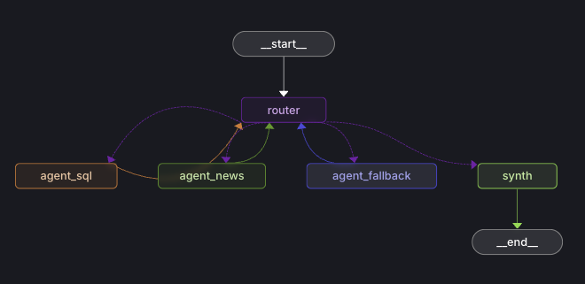

# 📈 Multi-Agent Stock & News Assistant (LangGraph)

This is a **LangGraph-powered, MCP-style multi-agent system** for answering stock-related queries, retrieving recent headlines, and handling general chat.

It supports **Postgres with pgvector** for semantic news search, and can be containerized with **Docker** for easy deployment.

---

## ⭐️ Features

- 🔀 **Routing** of user questions to specialized agents
- 📈 **Stock price** retrieval from Postgres
- 📰 **News headline** retrieval from pgvector store
- 💬 **Fallback agent** for general conversation
- 🧠 **Memory** with chat history

---

## 🗺️ Architecture Overview



> *Graph generated using LangGraph visualizer*

---

## 🧩 Agent Roles

### 🧭 Router
- Classifies user question into SQL, News, or Fallback.
- Uses regex heuristics + LLM classification.
- Sets flags in shared state (`need_sql`, `need_news`).

---

### 📈 agent_sql
- Connects to **Postgres** database.
- Runs SQL queries on `stock_prices` table.
- Fetches data such as open, close, high, low, volume.
- Returns structured JSON.

---

### 📰 agent_news
- Connects to **Postgres** with pgvector extension.
- Performs semantic search over `news_articles` table.
- Returns top headlines relevant to the ticker.
- Supports FAISS/vector store alternatives locally.

---

### 🗨️ agent_fallback
- Handles chit-chat or unsupported questions.
- Uses LLM to generate friendly fallback responses.

---

### ✨ synth
- Compiles final answer for the user.
- Formats stock data in clear natural-language sentences.
- Includes news headlines *only if* the question asks for them.
- Maintains chat history in state.

---

## 🗄️ Data Storage / pgvector

✅ Stock Prices Table Example:

| Column  | Type    |
| ------- | ------- |
| symbol  | TEXT    |
| date    | DATE    |
| open    | NUMERIC |
| close   | NUMERIC |
| high    | NUMERIC |
| low     | NUMERIC |
| volume  | BIGINT  |

✅ News Articles Table with pgvector:

| Column     | Type         |
| ---------- | ------------ |
| ticker     | TEXT         |
| published  | DATE         |
| headline   | TEXT         |
| url        | TEXT         |
| embedding  | VECTOR(768)  |

✅ pgvector extension:

- Enables semantic search over text.
- Stores LLM-generated embeddings.
- Used by `agent_news` to find top relevant headlines for a stock ticker.

---

## 🐳 Docker Usage

Run Postgres with pgvector using **Docker**:

**Example docker-compose.yml snippet:**

```yaml
version: '3'
services:
  postgres:
    image: pgvector/pgvector:latest
    environment:
      POSTGRES_USER: postgres
      POSTGRES_PASSWORD: yourpassword
      POSTGRES_DB: stocks
    ports:
      - "5432:5432"
    volumes:
      - pgdata:/var/lib/postgresql/data
volumes:
  pgdata:
```

✅ pgvector is pre-installed in the image.  
✅ You can load your schema with SQL scripts.  

---

## ⚙️ Environment Setup

Create a `.env` file:

```
DB_NAME=stocks
DB_USER=postgres
DB_PASS=yourpassword
DB_HOST=localhost
DB_PORT=5432

LLM_MODEL=ollama
```

---

## 🧮 Example User Queries

✅ "What was the close price of AAPL on 06/12/2025?"  
→ routed to **agent_sql**

✅ "Give me latest news for Microsoft."  
→ routed to **agent_news**

✅ "Hi there!"  
→ routed to **agent_fallback**

✅ "What is the open and close price of AMZN on 06/11/2025 and related news?"  
→ routed to **both** agent_sql and agent_news

---

## 🧑‍💻 Running the CLI

Interactive chat:
```bash
python main.py
```

Example:
```
You: What was the open price of MSFT on 06/12/2025?
AI: On June 12, 2025, Microsoft (MSFT) stock opened at 478.87 and closed at 475.02.
```

One-off question:
```bash
python main.py "Give me the close price of AAPL on 06/12/2025"
```

---

## 📦 Example Folder Structure

```
/agents
    sql_agent.py
    news_agent.py
    fallback_agent.py
/images
    langgraph-workflow.png
main.py
.env
requirements.txt
README.md
```

---

## ❤️ About MCP

This project **follows the MCP design pattern**:

✅ Shared state / context  
✅ Planner/router to decide next steps  
✅ Specialist agents for discrete tasks  
✅ Synth node for final answer  

Your agents are currently **local functions**.  

✅ Optionally, you can convert them to **MCP servers** in the future:
- Expose them over HTTP.
- Call them via `langchain-mcp-adapters`.
- Enable fully decoupled microservices architecture.

---

## 🧭 Next Steps / Ideas

⭐ Convert agents to **MCP servers** for remote access  
⭐ Use **langchain-mcp-adapters** for standardized tool calls  
⭐ Add more agents (e.g. earnings calendar, analyst ratings)  
⭐ Deploy with LangGraph server for persistent sessions  
⭐ Improve planner with advanced intent classification

---

## 📜 License

MIT License. Feel free to adapt and extend!
