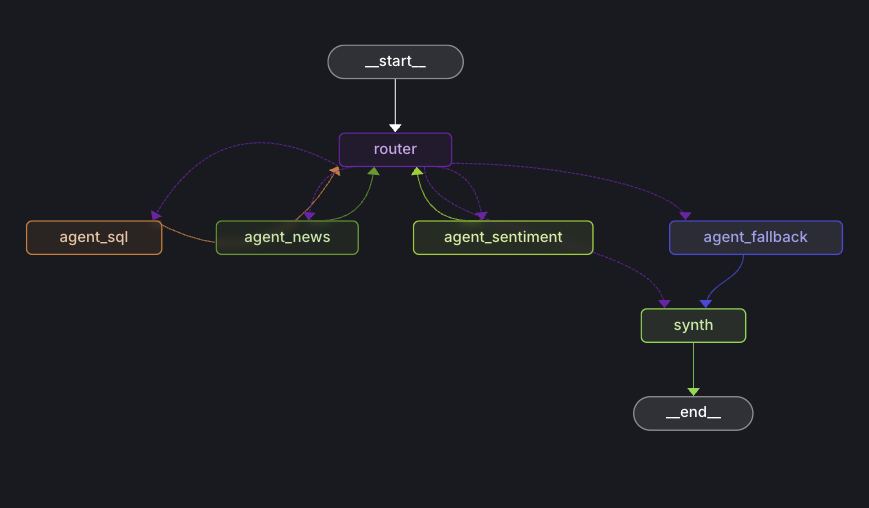

# FinanceScope - AI Stock & Market Analysis

Intelligent financial analysis with real-time stock data, news insights, and sentiment analysis powered by multi-agent LangGraph workflows.



## 🚀 Quick Start

### Prerequisites
- Docker and Docker Compose
- Node.js 18+ and npm
- Python 3.11+
- PostgreSQL (for local development)

### 🏃‍♂️ Quick Start (4-Terminal Setup)

#### Terminal 1: Database
```bash
# Start PostgreSQL database
docker compose up db -d
```

#### Terminal 2: MCP Servers
```bash
cd backend
python3 start_all_servers.py
```
This starts multiple MCP (Model-Controller-Presenter) agents:
- SQL Agent (port 8010)
- News Agent (port 8020)
- Fallback Agent (port 8030)
- Sentiment Agent (port 8040)

#### Terminal 3: Backend API
```bash
cd backend
uvicorn main:app --reload --host 0.0.0.0 --port 8000
```

#### Terminal 4: Frontend
```bash
cd frontend
npm install
npm run dev
```

🌐 Access the application at: http://localhost:3000

## 🏗️ System Architecture

### Core Components

#### 1. Database Layer
- **PostgreSQL**: Primary data store for stock data, news, and analysis
- **Schema**: Optimized for financial time-series data and relationships

#### 2. MCP (Model-Controller-Presenter) Servers

| Agent | Port | Description |
|-------|------|-------------|
| SQL Agent | 8010 | Handles complex financial queries and data analysis |
| News Agent | 8020 | Processes and analyzes financial news |
| Fallback Agent | 8030 | Handles general queries and fallback scenarios |
| Sentiment Agent | 8040 | Performs sentiment analysis on news and social data |

#### 3. Backend (FastAPI)
- RESTful API endpoints
- Authentication & Authorization
- Request validation and routing
- Integration with MCP agents

#### 4. Frontend (Next.js)
- Modern React-based UI
- Real-time data visualization
- Interactive dashboards
- Responsive design

## 🔍 Example Queries

Here are some example queries you can try with the system:

### Stock Price Queries
- `Can you tell me the open price of AAPL from 2025-06-06 to 2025-06-11` 
  *(Runs SQL node)*
- `Can you tell me the open price of AAPL on 2025-06-06` 
  *(Runs SQL node)*
- `Can you tell me the open price, close price of AAPL from 2025-06-06 to 2025-06-11` 
  *(Runs SQL node)*
- `Can you tell me the close price of MSFT and AAPL from 2025-06-06 to 2025-06-11` 
  *(Runs SQL node for multiple tickers)*

### News Queries
- `Latest news of MSFT` 
  *(Runs News node)*
- `Latest news of AAPL` 
  *(Runs News node)*

### Combined Queries
- `Can you tell me the open price of AAPL from 2025-06-06 to 2025-06-11 and can you give me the latest news of AAPL` 
  *(Runs SQL node then News node)*
- `Can you tell me the close price of MSFT from 2025-06-01 to 2025-06-06 and can you give me the latest news of MSFT` 
  *(Runs SQL node then News node)*

### Sentiment Analysis
- `Can you tell me the sentiment of the latest news about Apple stock from 06/01/2025 to 06/11/2025` 
  *(Runs News node then Sentiment node)*

## 🛠️ Development

### Environment Setup
1. Clone the repository
2. Set up Python virtual environment:
   ```bash
   python -m venv venv
   source venv/bin/activate  # On Windows: .\venv\Scripts\activate
   pip install -r backend/requirements.txt
   ```
3. Install frontend dependencies:
   ```bash
   cd frontend
   npm install
   ```

### Running Tests
```bash
# Backend tests
cd backend
pytest

# Frontend tests
cd frontend
npm test
```

## 🔍 Troubleshooting

### Common Issues

#### Port Conflicts
If you see "address already in use" errors:
```bash
# Find and kill processes
lsof -ti :8020 | xargs kill -9
lsof -ti :8030 | xargs kill -9
```

#### Database Connection Issues
Ensure PostgreSQL is running:
```bash
docker ps  # Check if db container is running
```

## 📚 Documentation

- [API Documentation](http://localhost:8000/docs) (when backend is running)
- [MCP Agent API](http://localhost:8010/mcp) (SQL Agent example)
- [LangGraph Documentation](https://langchain-ai.github.io/langgraph/)

## 📄 License

MIT

# 3. Start backend locally (new terminal)
cd backend
uvicorn main:app --reload

# 4. Start frontend (new terminal)
cd frontend
npm run dev
```

### Alternative: Full Docker Setup
```bash
# 1. Start all Docker services
cd backend
docker compose up -d

# 2. Start MCP servers (new terminal)
cd backend
python3 start_all_servers.py

# 3. Start frontend (new terminal)
cd frontend
npm run dev
```

## 🌐 Access URLs

- **Frontend**: http://localhost:3000
- **Backend API**: http://localhost:8000
- **API Documentation**: http://localhost:8000/docs
- **Database**: localhost:5432 (internal)

## 📊 Experiment Tracking

FinanceScope uses **Databricks MLflow** for experiment tracking and model management. This allows for:
- Tracking model performance and metrics
- Versioning of different model configurations
- Comparing experiment results
- Managing the machine learning lifecycle

All experiment data is stored in the Databricks workspace, accessible through the Databricks UI.

## 🐘 Database Access

### PostgreSQL Shell Access
```bash
# Interactive PostgreSQL shell
docker exec -it backend-db-1 psql -U postgres -d agentic_stock
```

### Database Connection Details
- **Host**: localhost
- **Port**: 5432
- **Database**: agentic_stock
- **Username**: postgres
- **Password**: secret

### Common PostgreSQL Commands
```sql
-- See all tables
\dt

-- Look at stock_data table structure
\d stock_data

-- See sample data
SELECT * FROM stock_data LIMIT 5;

-- Count total rows
SELECT COUNT(*) FROM stock_data;

-- Exit PostgreSQL shell
\q
```

### One-time Database Queries (without entering shell)
```bash
# Check database version
docker exec backend-db-1 psql -U postgres -d agentic_stock -c "SELECT version();"

# List all tables
docker exec backend-db-1 psql -U postgres -d agentic_stock -c "\dt"

# Count rows in stock_data table
docker exec backend-db-1 psql -U postgres -d agentic_stock -c "SELECT COUNT(*) FROM stock_data;"
```

## 🛠️ Development Commands

### Check Container Status
```bash
docker ps
```

### View Service Logs
```bash
# Backend logs (if using Docker)
docker logs backend-api-1 -f


# Database logs
docker logs backend-db-1 -f
```

### Restart Services
```bash
# Restart Docker services
docker compose down
docker compose up -d

# Restart MCP servers
# Ctrl+C to stop, then run again:
python3 start_all_servers.py
```

## 🔧 MCP Server URLs

When MCP servers are running:
- **SQL Agent**: http://localhost:8010/mcp
- **News Agent**: http://localhost:8020/mcp
- **Fallback Agent**: http://localhost:8030/mcp
- **Sentiment Agent**: http://localhost:8040/mcp

## 📊 Features

- **Stock Price Analysis**: Real-time stock data queries and analysis
- **News Integration**: Latest financial news and headlines
- **Sentiment Analysis**: Correlation between news sentiment and stock prices
- **Multi-Agent System**: Specialized agents for different data sources
- **Persistent Conversations**: Chat history maintained across sessions
- **Interactive UI**: Modern chat interface with conversation management
- **Databricks MLflow**: Experiment tracking and model performance monitoring

## 🛑 Stopping the Application

```bash
# Stop MCP servers
# Ctrl+C in the terminal running start_all_servers.py

# Stop frontend
# Ctrl+C in the terminal running npm run dev

# Stop backend (if running locally)
# Ctrl+C in the terminal running uvicorn

# Stop Docker services
cd backend
docker compose down
```

## 🐛 Troubleshooting

### Port Already in Use
```bash
# Check what's using ports
lsof -i :5432  # Database
lsof -i :8000  # Backend

# Kill existing containers
docker stop backend-db-1 backend-api-1
docker rm backend-db-1 backend-api-1
```

### Database Connection Issues
```bash
# Check if database is running
docker ps | grep db

# Test database connection
docker exec backend-db-1 psql -U postgres -d agentic_stock -c "SELECT current_database();"
```

### MCP Servers Not Starting
```bash
# Check for Python import errors
python3 -c "from graph import run_query_with_persistence; print('Import successful')"
{{ ... }}
# Check if ports are available
netstat -an | grep -E "(8010|8020|8030|8040)"
```

## 📁 Project Structure

```
.
├── backend/
│   ├── agents/              # MCP server agents
│   ├── tools/               # Database and utility tools
│   ├── tests/               # Test files and ticker mapping
│   ├── docker-compose.yml   # Docker services configuration
│   ├── main.py             # FastAPI application
│   └── graph.py            # LangGraph workflow
├── frontend/
│   ├── src/
│   │   ├── app/            # Next.js app router
│   │   └── components/     # React components
│   └── package.json
└── README.md
```

## 🔄 Development Workflow

1. **Start Database**: `docker compose up db -d`
2. **Start MCP Servers**: `python3 start_all_servers.py`
3. **Start Backend**: `uvicorn main:app --reload` (for development)
4. **Start Frontend**: `npm run dev`
5. **Access Application**: http://localhost:3000
6. **Monitor Experiments**: Access Databricks MLflow UI

## 🎯 Example Queries

Try these queries in the application:
- "What's the latest news on MSFT?"
- "Show me AAPL stock prices from 2025-06-06 to 2025-06-11"
- "Analyze sentiment for TSLA news"
- "What's the correlation between NVDA news and stock price?"

Happy coding! 🎉